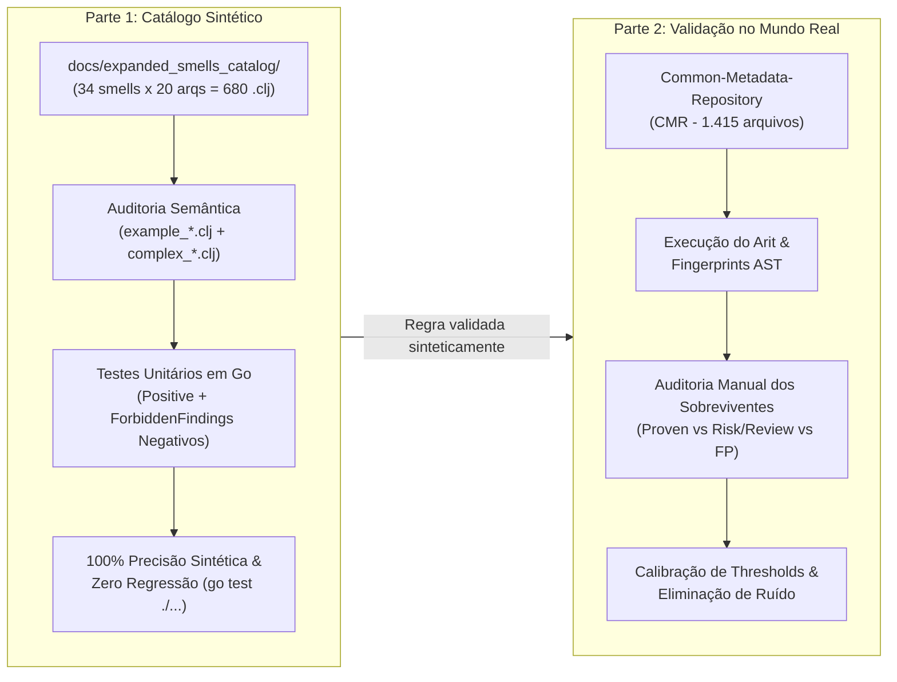

# Plano de acompanhamento da precisão do Arit

Atualizado em: **2026-08-15**

## Estrutura do processo em duas partes

O trabalho de calibração e evolução da precisão do Arit está estruturado em **duas partes distintas, sequenciais e complementares**:

### Parte 1 — Garantia de precisão no catálogo sintético (`docs/expanded_smells_catalog/`)
O primeiro passo obrigatório para qualquer regra é garantir comportamento correto, determinístico e livre de falsos positivos sintéticos sobre os exemplos controlados:
1. **Auditoria da especificação do smell**:
   - Cada smell possui documentação dedicada (`.md`) e 20 exemplos (`15x example_*.clj` diretos + `5x complex_*.clj` limítrofes).
   - Validar que o código de cada arquivo reflete a definição semântica precisa do smell, sem discrepâncias conceituais (conforme catalogado em [`docs/synthetic_dataset_smell_audit.md`](docs/synthetic_dataset_smell_audit.md)).
2. **Implementação de testes unitários com casos negativos pareados em Go**:
   - Para cada regra, criar/manter a suíte em `internal/test/suite/` e fixtures em `internal/test/data/`.
   - **Obrigatoriedade de mais testes negativos do que positivos**, utilizando `ForbiddenFindings` para cobrir:
     - Resolução canônica de aliases e símbolos (`symbol_resolution.go`).
     - *Shadowing* local de símbolos (`let`, `fn`, `loop`).
     - Macros, *quoting*, *unquote-splicing* e código gerado.
     - Formas não avaliadas e escopos diferidos (`comment`, `declare`, blocos de teste, REPL).
3. **Métricas de encerramento da Parte 1**:
   - 100% de taxa de detecção nos exemplos sintéticos genuínos da regra.
   - Zero ocorrências cruzadas indevidas que constituam falsos positivos sintéticos.
   - 100% de aprovação na suíte completa do Go (`go test ./...`).

---

### Parte 2 — Calibração e validação empírica no mundo real (CMR / Corpus Amplo)
Após a validação sintética da Parte 1, a regra é avaliada contra grandes bases de código de produção para eliminar falsos positivos do mundo real e evitar fadiga de alertas:
1. **Execução em corpus real**:
   - Execução contínua sobre o **Common-Metadata-Repository (CMR)** da NASA (1.415 arquivos).
   - Calibração de limiares estatísticos sobre corpus amplo (ex.: média + 2 desvios-padrão em 430 repositórios em `excessive-refers`).
2. **Auditoria manual dos achados reais sobreviventes**:
   - Todo achado remanescente é classificado manualmente entre:
     - **Defeito/Redundância Comprovada (`proven`)**: Padrão incorreto ou ineficiência comprovada (ex.: `(doall (mapv ...))`, `def` em escopo local).
     - **Aviso de Risco para Revisão (`high`/`heuristic`)**: Padrão observável de alto risco sem presumir intenção do desenvolvedor (ex.: `production-doall` em I/O, `unnecessary-laziness`).
     - **Falso Positivo Residual**: Casos em que o detector disparou em código idiomático legítimo, demandando refinamento na AST/Go.
3. **Diretrizes e encerramento da Parte 2**:
   - Preferência estrita por falsos negativos diante de ambiguidades semânticas que a análise estática não possa provar.
   - Não suprimir avisos legítimos de risco apenas por inferência de "intenção" do autor.
   - Nenhuma regra é desabilitada: refina-se o predicado e calibra-se o limiar.
   - Registro formal dos falsos negativos deliberados.

---

## Objetivo e regras de decisão

Este documento acompanha o trabalho de precisão das 34 regras específicas de Clojure.
O perfil padrão deve preferir falsos negativos a falsos positivos. Nenhuma regra será
desabilitada durante este ciclo. Ao mesmo tempo, intenção não é uma propriedade que um
analisador estático possa presumir: quando houver um padrão observável e um risco definido,
o aviso deve ser emitido e a decisão de mantê-lo cabe ao desenvolvedor. Precisão significa
distinguir na mensagem um defeito ou equivalência comprovada de um risco que exige revisão,
sem suprimir o segundo apenas porque ele pode ter sido intencional.

Regras de decisão transversais:

- não inferir intenção a partir de nomes, caminhos, comentários ou usos comuns;
- não chamar de defeito aquilo que a análise só consegue caracterizar como risco;
- suprimir apenas quando falta o próprio padrão, a forma não é avaliada ou a resolução
  mostra que outro símbolo está sendo chamado;
- manter regras habilitadas e delegar ao desenvolvedor a avaliação de usos deliberados;
- usar níveis de confiança para comunicar força da evidência, não para apagar avisos por
  intenção presumida.

Legenda:

- `[x]` concluído e validado no escopo descrito;
- `[ ]` pendente;
- **PARCIAL**: já recebeu implementação ou testes, mas ainda não satisfaz o contrato de
  encerramento;
- **MONITORAMENTO**: não requer mudança agora, porém deve ser reaberto se aparecer
  contraexemplo.

## Linha de base atual

- Executável de validação: SHA-256
  `bcf1f7b4be117438dada484ab71fa20f4da32a87d717ce2468cc57665ae74186`.
- Repositório real: Common-Metadata-Repository, 1.415 arquivos analisados.
- Achados atuais observados: **449**.
- Baseline anterior à correção estrutural: **665**.
- Redução explicada:
  - `nested-forms`: 95 → 3;
  - `thread-ignorance`: 58 → 0;
  - `misused-threading`: 5 → 0;
  - `unnecessary-into`: 67 → 8;
  - `production-doall`: 33 → 35; a diferença decorre da resolução canônica atual e os
    achados se dividem em 3 redundâncias demonstráveis e 32 avisos de revisão;
  - `excessive-refers`: 4 → 0 no CMR com limiar empírico inclusivo de 24, calculado como
    média + 2 desvios-padrão em 430 repositórios; zero significa que o CMR não contém
    namespace acima desse corte.
- Catálogo sintético: 34 grupos e 680 arquivos, preservados sem alteração.
- Os números representam achados do detector, não defeitos confirmados.

## Trabalho transversal

### Concluído

- [x] Adicionar resolução central de símbolos, aliases, shadowing e chamadas canônicas.
- [x] Adicionar contexto de execução para distinguir load time, execução diferida e forms
  não avaliadas.
- [x] Adicionar fingerprints de AST aos achados para comparação entre execuções.
- [x] Ampliar o framework de testes com `ForbiddenFindings` para regressões negativas.
- [x] Criar testes de aliases, shadowing, macros, quoting e execução diferida nas regras
  refinadas.
- [x] Preservar `docs/results/**`, `../../reports/**`, o catálogo sintético e o CMR.
- [x] Reorganizar a documentação dos 34 smells, mantendo as versões anteriores em arquivo
  legado.
- [x] Documentar que o catálogo mede cobertura sintética e que ocorrências cruzadas não
  são falsos positivos automaticamente.
- [x] Registrar que intenção não é critério de supressão e que avisos de risco devem
  delegar a decisão final ao desenvolvedor.

### Pendente

- [ ] Criar classificador único de arquivo: produção, teste, integração, desenvolvimento,
  gerado e amostra.
- [ ] Respeitar `analyze-tests` nesse classificador e remover filtros de caminho duplicados
  dentro das regras.
- [ ] Adicionar confiança explícita (`proven`, `high`, `heuristic`) ao modelo de finding.
- [ ] Exibir confiança (`proven`, `high`, `heuristic`) sem desabilitar regras nem ocultar
  achados por intenção presumida.
- [ ] Extrair utilitários compartilhados de prova de equivalência: posição do argumento,
  tipo de retorno, ordem, quantidade de avaliações, cardinalidade e realização.
- [ ] Criar avaliador separado dos scripts protegidos de `docs/results`, com manifesto de
  expectativas positivas e negativas.
- [ ] Atualizar README, relatório sintético, relatório do CMR e metodologia externa com a
  geração atual, preservando os relatórios históricos.

## Situação por regra

### Concluídas ou em monitoramento

- [x] `immutability-violation` — **2 achados**. Restrita a `def`/`defonce` em escopo local
  e `ref-set` fora de `dosync`; os dois resultados reais foram confirmados.
- [x] `blocking-inside-go` — **3 achados**. Primitivas bloqueantes e propagação local
  resolvida; **MONITORAMENTO**.
- [x] `nested-atoms` — **0 achados**. Construção mutável aninhada exige evidência direta;
  **MONITORAMENTO**.
- [x] `unmanaged-resource-io` — **2 achados**. Casos locais sem fechamento comprovado;
  ownership interprocedural permanece deliberadamente fora do escopo.
- [x] `multiple-evaluation-in-macros` — **6 achados**. Repetição em caminhos executáveis,
  respeitando quote, branches e captura por binding; **MONITORAMENTO**.
- [x] `conditional-build-up` — **1 achado**. Mantida somente transformação local linear;
  **MONITORAMENTO**.
- [x] `nested-forms` — **3 achados**. Somente fusões seguras de `let` e `doseq`, uma
  emissão por cadeia e sem atravessar fronteiras semânticas.
- [x] `thread-ignorance` — **0 achados**. Exige pipeline linear, chamadas resolvidas,
  direção consistente, usos únicos e intermediários genéricos.
- [x] `misused-threading` — **0 achados**. Exige ao menos duas etapas resolvidas e
  consistentemente opostas à macro; lambdas, mudança de tipo e `into` são negativas.
- [x] `production-doall` — **35 achados**. Três chamadas diretamente sobre
  `mapv`/`filterv` resolvidos recebem diagnóstico de redundância demonstrável; as outras
  32 recebem aviso de realização/retenção para avaliação humana. I/O, efeitos, transações,
  retorno e sincronização não são suprimidos por intenção presumida.
- [x] `marker-protocol` — **0 achados**. Detecção restringida e protegida por casos
  negativos; manter em monitoramento em outros projetos.
- [x] `misuse-of-channel-closing-semantics` — **0 achados**. Sentinela exige contexto de
  produtor/consumidor; manter em monitoramento.
- [x] `monolithic-namespace-split` — **0 achados**. Resolução de `load`/`in-ns` e testes de
  contexto adicionados.
- [x] `non-idiomatic-record-construction` — **0 achados**. Só considera construtores de
  records resolvidos.
- [x] `single-segment-namespace` — **0 achados**. Exceções e contexto de arquivo cobertos
  por testes.
- [x] `refs-in-dependency-vector` — **0 achados**. Implementação e testes adicionados;
  validar novamente quando houver corpus real do framework correspondente.
- [x] `overengineering-with-core-async` — **0 achados**. Implementação conservadora e
  testes adicionados; monitorar corpus com pipelines core.async reais.

### Implementadas, mas ainda parciais

- [ ] **PARCIAL REABERTA** `unnecessary-into` — **8 achados prováveis, não comprovados**.
  A fusão pode trocar percurso `Seqable` por `IReduceInit`; falta provar o tipo/protocolo
  da origem, rejeitar resolução desconhecida e alinhar a taxonomia com
  `unnecessary-laziness`.
- [ ] **PARCIAL** `relying-on-load-time-side-effects` — **16 achados**. Contexto de
  execução já foi modelado; falta distinguir recurso imutável de I/O externo mutável.
- [x] `unnecessary-laziness` — **15 achados** no CMR e **11** no catálogo. A regra exige
  resolução canônica de `vec` e do produtor lazy, ignora shadowing e formas não avaliadas,
  e emite aviso de risco sem afirmar equivalência eager ou presumir intenção.
- [ ] **PARCIAL** `unnecessary-macros` — **9 achados**. Macros de controle e avaliação já
  são protegidas; falta modelar especialização de primitivas e performance.
- [ ] **PARCIAL** `improper-emptiness-check` — **101 achados**. Houve restrição de
  contexto; falta garantir tipo de retorno e limitar a posições estritamente booleanas.
- [ ] **PARCIAL** `verbose-checks` — **74 achados**. Vários contraexemplos foram cobertos;
  falta inferência suficiente de tipo e contrato de retorno.
- [x] `excessive-refers` — **0 achados** no CMR. A agregação por namespace usa limiar
  empírico inclusivo de 24 (média + 2 desvios-padrão em 430 repositórios), com regressão
  explícita para 23/24. **Pendente documental:** registrar média, desvio e manifesto do
  corpus para reprodução independente.
- [ ] **PARCIAL** `namespace-load-side-effects` — **0 achados**. Contexto de execução e
  resolução foram melhorados; falta auditoria final específica antes de encerrar.

### Ainda precisam de refinamento prioritário

- [ ] `implicit-namespace-dependencies` — **72 achados**. Reconhecer DSLs e exigir
  namespace ausente, colisão ou origem realmente opaca.
- [ ] `misuse-of-dynamic-scope` — **8 achados**. Exigir transporte problemático de estado
  de negócio, não apenas definição ou `binding`.
- [ ] `map-with-nil-values` — **74 achados**. Manter habilitada, mas exigir contrato que
  prove que omissão e `nil` deveriam ser equivalentes.
- [ ] `private-multimethods` — **3 achados**. Manter habilitada, mas só emitir quando uma
  extensão externa necessária for comprovadamente impedida.
- [ ] `case-with-non-literal-test-values` — **6 achados**. Corrigir a mensagem e distinguir
  constantes válidas de expressões que o autor pretendia avaliar.
- [ ] `redundant-do-block` — **11 achados**. Limitar a corpos com `do` implícito conhecido
  e respeitar macros, metadados e posições sintáticas.

### Auditoria específica ainda não realizada neste ciclo

- [ ] `dynamically-scoped-singleton-resource` — **0 achados**. Revisar contrato de recurso,
  ownership, troca de thread e lazy seqs.
- [ ] `direct-usage-of-clojure-lang-rt` — **0 achados**. Separar aplicação comum de
  tooling, compiladores, profilers e bridges Java.
- [ ] `non-idiomatic-parameter-binding` — **0 achados**. Avaliar número de opcionais,
  compatibilidade de API e chamadas reais antes de sugerir mapa de opções.

## Ordem de execução recomendada

### Fase 1 — Encerrar a família estrutural

- [x] Extrair a especificação compartilhada de posição `->`/`->>` atualmente usada por
  `thread-ignorance`.
- [x] Refinar `misused-threading` com essa especificação.
- [x] Adicionar mais negativos que positivos e revisar os 5 achados do CMR.

### Fase 2 — Coleções e realização

- [ ] Concluir `unnecessary-into` — a redução 67 → 8 foi mantida como etapa intermediária,
  mas a prova semântica dos sobreviventes foi reaberta.
- [x] Refinar `production-doall` — 35 achados atuais: 3 redundâncias demonstráveis e 32
  avisos de risco calibrados. A regra não presume intenção e não afirma redundância nos
  casos em que ela não pode ser provada.
- [x] Calibrar `unnecessary-laziness` — 15 achados reais permanecem como avisos de revisão;
  a regra não recomenda transformação automática sem prova de contrato da origem.
- [ ] Comparar fingerprints e revisar manualmente todos os sobreviventes.

### Fase 3 — Namespaces e contexto de execução

- [ ] Refinar `implicit-namespace-dependencies`.
- [ ] Refinar `misuse-of-dynamic-scope`.
- [ ] Concluir `relying-on-load-time-side-effects` e auditar
  `namespace-load-side-effects`.

### Fase 4 — Contratos de dados e extensibilidade

- [ ] Refinar `map-with-nil-values` sem desabilitá-la.
- [ ] Refinar `private-multimethods` sem desabilitá-la.
- [ ] Auditar `dynamically-scoped-singleton-resource` e
  `non-idiomatic-parameter-binding`.

### Fase 5 — Regras de estilo e diagnóstico

- [ ] Corrigir `case-with-non-literal-test-values`.
- [ ] Concluir `improper-emptiness-check`, `verbose-checks` e `redundant-do-block`.
- [ ] Auditar `direct-usage-of-clojure-lang-rt`.

### Fase 6 — Avaliação consolidada

- [x] Executar `go test ./... -count=1` — suíte completa aprovada depois do alinhamento da
  regressão de `excessive-refers` à fronteira empírica 23/24.
- [x] Executar o catálogo atualizado, mantendo 34 grupos e 680 arquivos; o grupo
  `25_excessive_refers` foi alinhado ao corte empírico `>=24`.
- [x] Executar o Arit no CMR e comparar com a baseline; a execução atual totaliza 449
  achados.
- [x] Classificar manualmente os sobreviventes de `misused-threading`: três candidatos
  intermediários eram usos válidos de `into`; após a correção não restou achado.
- [x] Registrar os falsos negativos deliberados de `misused-threading`.
- [ ] Gerar novo relatório versionado sem sobrescrever `docs/results/**` ou
  `../../reports/**`.

## Checklist obrigatório para encerrar uma regra

### Parte 1 — Garantia no catálogo sintético e suíte Go
- [ ] Definição semântica formal e risco observável documentados no `.md` da regra em `docs/expanded_smells_catalog/`.
- [ ] 20 exemplos `.clj` auditados (`15x example_*.clj` + `5x complex_*.clj`) com correspondência semântica confirmada.
- [ ] Implementação de testes em `internal/test/suite/` com fixtures em `internal/test/data/`.
- [ ] **Mais testes negativos (`ForbiddenFindings`) do que positivos** no framework de testes.
- [ ] Aliases, shadowing, macros, quoting e formas não avaliadas (`comment`, etc.) cobertos por testes negativos.
- [ ] Taxa de detecção de 100% sobre os casos genuínos da regra no catálogo sintético.
- [ ] Suíte Go completa aprovada (`go test ./... -count=1`).

### Parte 2 — Calibração e validação no mundo real (CMR)
- [ ] Execução no Common-Metadata-Repository (CMR) comparada com a baseline e rastreada por fingerprints.
- [ ] Achados reais sobreviventes auditados manualmente um a um.
- [ ] Classificação documentada entre `proven` (defeito/redundância provada) e `high`/`heuristic` (aviso de revisão de risco).
- [ ] Eliminação de falsos positivos em código de produção e idiomas canônicos do Clojure.
- [ ] Falsos negativos deliberados formalmente registrados.

## Próxima atividade prioritária

Garantir a precisão da **Parte 1 (Catálogo Sintético)** nas regras que ainda possuem disparos imprecisos ou incompletos em `docs/expanded_smells_catalog/`, consolidando as suítes de testes com casos negativos em Go antes de avançar para a calibração de campo da Parte 2.
